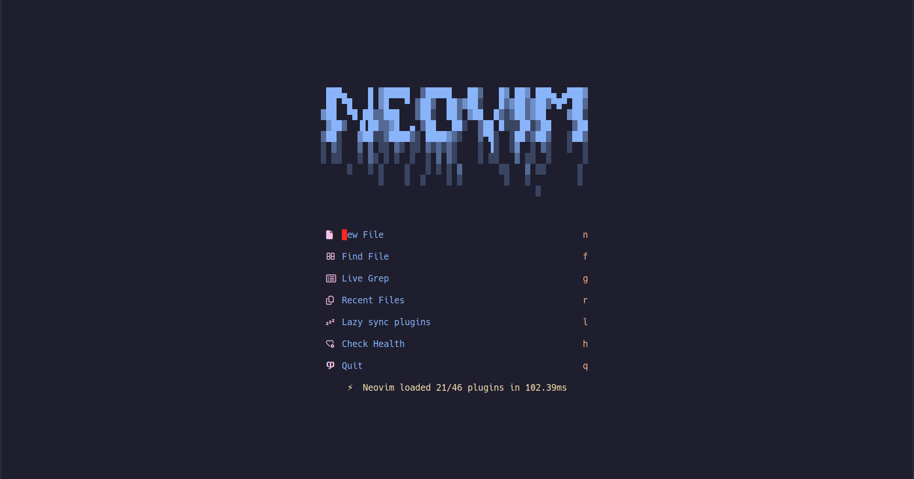

    
    
    <!--  -->
    <!-- 
     -->
    
    

# [NeoVim]("https://neovim.io/") Configuration

#### Add or Remove any files to [plugins](./lua/iUseNeovimBtw/plugins/) directory for customizations

---

---

## Plugins

### Core Functionality

- **[lazy.nvim](https://github.com/folke/lazy.nvim)**: Plugin manager.
- **[nvim-lspconfig](https://github.com/neovim/nvim-lspconfig)**: Configurations for Neovim's built-in LSP client.
- **[nvim-cmp](https://github.com/hrsh7th/nvim-cmp)**: Autocompletion framework.
- **[mason.nvim](https://github.com/williamboman/mason.nvim)**: LSP server, DAP, and linter/formatter installer.
- **[nvim-treesitter](https://github.com/nvim-treesitter/nvim-treesitter)**: Syntax highlighting and code parsing.
- **[telescope.nvim](https://github.com/nvim-telescope/telescope.nvim)**: Fuzzy finder and file search.
- **[nvim-notify](https://github.com/rcarriga/nvim-notify)**: Enhanced notification system.

### UI Enhancements

- **[lualine.nvim](https://github.com/nvim-lualine/lualine.nvim)**: Statusline plugin.
- **[nvim-tree.lua](https://github.com/nvim-tree/nvim-tree.lua)**: File explorer.
- **[bufferline.nvim](https://github.com/akinsho/bufferline.nvim)**: Tab-like buffer management.
- **[which-key.nvim](https://github.com/folke/which-key.nvim)**: Displays available keybindings.

### Colorschemes

- **[catppuccin](https://github.com/catppuccin/nvim)**: Soft pastel theme.
- **[dracula.nvim](https://github.com/Mofiqul/dracula.nvim)**: Dracula colorscheme.
- **[monokai.nvim](https://github.com/tanvirtin/monokai.nvim)**: Monokai colorscheme.
- **[onedark.nvim](https://github.com/navarasu/onedark.nvim)**: One Dark colorscheme.
- **[darkplus.nvim](https://github.com/lunarvim/darkplus.nvim)**: VSCode-inspired dark theme.

### Editing Utilities

- **[Comment.nvim](https://github.com/numToStr/Comment.nvim)**: Commenting utility.
- **[nvim-surround](https://github.com/kylechui/nvim-surround)**: Surround text objects.
- **[nvim-highlight-colors](https://github.com/brenoprata10/nvim-highlight-colors)**: Highlight color codes in files.
- **[nvim-autopairs](https://github.com/windwp/nvim-autopairs)**: Auto-closing pairs for brackets and quotes.
- **[nvim-ts-autotag](https://github.com/windwp/nvim-ts-autotag)**: Auto-close and rename HTML/JSX tags.
- **[nvim-ts-context-commentstring](https://github.com/JoosepAlviste/nvim-ts-context-commentstring)**: Context-aware comment strings.

### Git Integration

- **[gitsigns.nvim](https://github.com/lewis6991/gitsigns.nvim)**: Git decorations in the editor.
- **[lazygit.nvim](https://github.com/kdheepak/lazygit.nvim)**: Plugin for calling lazygit from within neovim.

### Miscellaneous

- **[harpoon](https://github.com/ThePrimeagen/harpoon)**: Quick navigation between files.
- **[todo-comments.nvim](https://github.com/folke/todo-comments.nvim)**: Highlight and manage TODO comments.
- **[dashboard-nvim](https://github.com/glepnir/dashboard-nvim)**: Start screen for Neovim.
- **[trouble.nvim](https://github.com/folke/trouble.nvim)**: Diagnostic and quickfix viewer.
- **[hop.nvim](https://github.com/phaazon/hop.nvim)**: Easy motion for jumping around the buffer.

---

## TODO

- [x] idk, Too many things
